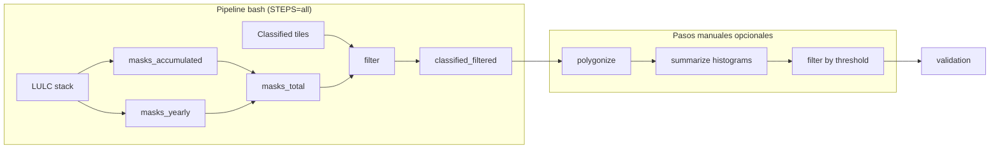

# Filtering

Post-clasificación MapBiomas Fire: máscaras LULC, filtrado de rasters clasificados, deduplicación temporal, polygonize y estadísticas de polígonos.

Entrada típica: GeoTIFFs del clasificador ([`../classification/`](../classification/README.md)).  
Salida filtrada: rasters listos para polygonize o validación ([`../validation/`](../validation/README.md)).

---

## Índice de archivos

| Archivo | Rol | ¿Cuándo usarlo? |
|---------|-----|-----------------|
| **`run_filtering_pipeline.sh`** | Orquestación bash (máscaras + filtrado) | Ejecución habitual en leftraru o local |
| **`run_filtering_pipeline_slurm.sh`** | Wrapper SLURM → pipeline bash | Job en cola NLHPC |
| **`cluster_paths.env.example`** | Plantilla de rutas y variables | Copiar a `cluster_paths.env` (no commitear) |
| **`run_classified_filters.py`** | LULC + temporal en un solo comando | Paso `filter` del pipeline; también manual |
| **`create_accumulated_class_masks.py`** | Máscaras acumuladas (clases fijas) | Paso `masks_accumulated` |
| **`create_yearly_masks.py`** | Máscaras anuales (río, infra, agri, pastura) | Paso `masks_yearly` |
| **`create_total_masks_by_year.py`** | `mascara_total_<year>.tif` | Paso `masks_total` |
| **`filter_classified_parallel.py`** | Aplica máscara LULC por año | Llamado por `run_classified_filters.py`; `--lulc-only` |
| **`filter_temporal_first_burn_year.py`** | Prioridad 2013 > 2014 > … por píxel | Llamado por `run_classified_filters.py`; `--temporal-only` |
| **`polygonize_mask_parallel.py`** | Raster → polígonos (GPKG) | Después del filtrado; usado en validación |
| **`summarize_histograms_by_region.py`** | Histogramas de área por región | Elegir umbral mínimo de polígono |
| **`filter_polygons_by_threshold.py`** | Filtra polígonos por área mínima (ha) | Tras elegir umbral |
| [LOCAL.md](LOCAL.md) | Guía interactiva leftraru (sin sbatch) | SSH en nodo login |
| [CLUSTER.md](CLUSTER.md) | Guía SLURM NLHPC | `sbatch` |

No hay otros scripts en este directorio: todo lo listado arriba está en uso.

---

## Flujo de trabajo



### A. Pipeline automatizado (`run_filtering_pipeline.sh`)

| Paso `STEPS` | Script | Salida |
|--------------|--------|--------|
| `masks_accumulated` | `create_accumulated_class_masks.py` | `mascaras/acumuladas/mascara_*_acumulado.tif` |
| `masks_yearly` | `create_yearly_masks.py` | `mascaras/by_year/mascara_<clase>_<year>.tif` |
| `masks_total` | `create_total_masks_by_year.py` | `mascaras/totales/mascara_total_<year>.tif` |
| **`filter`** | **`run_classified_filters.py`** | **`classified_filtered/`** (LULC + temporal) |

Pasos legacy (re-ejecución parcial): `lulc_filter`, `temporal_first_burn`.

**Ejecución:**

```bash
cd ~/fire
cp filtering/cluster_paths.env.example filtering/cluster_paths.env   # opcional
bash filtering/run_filtering_pipeline.sh
```

SLURM: ver [CLUSTER.md](CLUSTER.md). Interactivo leftraru: [LOCAL.md](LOCAL.md).

**Variables clave** (en `cluster_paths.env` o export):

| Variable | Default | Descripción |
|----------|---------|-------------|
| `LULC_STACK` | stack multibanda `.tif` | Una banda = un año MapBiomas |
| `CLASSIFIED_DIR` | tiles clasificados | Entrada del clasificador |
| `WORK_ROOT` | `filtering_work_local` | Raíz de salidas |
| `FILTER_OUTPUT_DIR` | `$WORK_ROOT/classified_filtered` | Salida final del filtrado |
| `STEPS` | `all` | Pasos a ejecutar (coma-separados) |
| `FROM_YEAR` / `TO_YEAR` | 2013–2025 | Años de máscaras y clasificados |
| `LULC_TO_YEAR` | 2024 | Último año con banda LULC real |
| `COPY_MASK_2025_FROM_2024` | 1 | Copia máscaras 2024→2025 si no hay banda 2025 |
| `KEEP_LULC_INTERMEDIATE` | 0 | Conservar `classified_lulc_only/` |
| `FILTER_NAME_CONTAINS` | *(vacío)* | Limitar temporal a filenames (ej. tile piloto) |
| `TEMPORAL_SPATIAL_MERGE` | 0 | 1 = fusionar vecinos 8-conectados al año origen |

**Estructura de salida:**

```
${WORK_ROOT}/
├── mascaras/
│   ├── acumuladas/
│   ├── by_year/
│   └── totales/
├── classified_filtered/     ← salida final (LULC + temporal)
├── classified_lulc_only/    ← solo si KEEP_LULC_INTERMEDIATE=1
└── logs/filter_stats.json
```

### B. Filtrado unificado (`run_classified_filters.py`)

Aplica en secuencia:

1. **LULC** — quita píxeles en clases no quemables (`filter_classified_parallel.py`).
2. **Temporal** — mismo píxel en varios años → gana el primero (`filter_temporal_first_burn_year.py`).

```bash
python filtering/run_classified_filters.py \
  --classified-dir /path/to/classi_v2 \
  --masks-dir /path/to/mascaras/totales \
  --output-dir /path/to/classified_filtered \
  --from-year 2013 --to-year 2025 \
  --stats-json /path/to/logs/filter_stats.json
```

Flags útiles: `--lulc-only`, `--temporal-only`, `--no-spatial-merge`, `--name-contains 141228`.

### C. Polygonize y umbral de área (manual)

No forman parte del pipeline bash; se corren cuando necesitas polígonos o validación.

**1. Polygonize** — un GPKG por raster:

```bash
python filtering/polygonize_mask_parallel.py \
  --input-dir /path/to/classified_filtered \
  --output-dir /path/to/polygons \
  --mask-value 1 --workers 4
```

**2. Histogramas** — inspeccionar distribución de áreas:

```bash
python filtering/summarize_histograms_by_region.py \
  --input-dir /path/to/polygons \
  --output-dir /path/to/histograms
```

**3. Umbral** — polígonos ≥ N hectáreas:

```bash
python filtering/filter_polygons_by_threshold.py \
  --input-dir /path/to/polygons \
  --output-gpkg /path/to/polygons_filtered.gpkg \
  --threshold-ha 10
```

Para validación con cicatrices de referencia: reproyectar a CRS de área igual ([`../validation/`](../validation/README.md)) y luego `intersect_top_n_scars_with_classified.py`.

---

## Referencia por script

### Construcción de máscaras

**`create_accumulated_class_masks.py`** — OR de clases fijas en todas las bandas del stack LULC: roca (`29`), arena (`23`), salar (`61`), hielo (`34`), sin vegetación (`25`). Salida: `mascara_<nombre>_acumulado.tif`.

**`create_yearly_masks.py`** — Por año: río/lago (`33`), infraestructura (`24`), agricultura (`15`), pastura (`18`). Salida: `mascara_<clase>_<year>.tif`. Paraleliza por año (`--workers`).

**`create_total_masks_by_year.py`** — Combina acumuladas + anuales en `mascara_total_<year>.tif` (`1` = quitar, `0` = mantener). Input de `filter_classified_parallel.py`.

### Filtrado de rasters

**`filter_classified_parallel.py`** — Por tile: extrae año del nombre (`20xx`), alinea `mascara_total_<year>.tif`, escribe `*_filtered_<timestamp>.tif` + JSON de resumen.

**`filter_temporal_first_burn_year.py`** — Agrupa tiles por región (año en token índice 3, p. ej. `b14_chile_r1_2013_...`). Por píxel: 2013 > 2014 > …. Salida `uint8` 0/1 con sufijo `_first_burn_year` (configurable).

### Polígonos y estadísticas

**`polygonize_mask_parallel.py`** — `rasterio.features.shapes` sobre píxeles = 1. Salida: `*_mask1.gpkg`.

**`summarize_histograms_by_region.py`** — Histogramas por archivo, carpetas `region_<X>/histogramas/`. Regiones: 1, 2, 4, 6.

**`filter_polygons_by_threshold.py`** — Filtra por `--threshold-ha`; exporta un GPKG unificado.

---

## Dependencias

| Scripts | Paquetes Python |
|---------|-----------------|
| Pipeline máscaras + filtrado | `numpy`, `rasterio` |
| Polygonize + umbral | `geopandas` |
| Histogramas | `geopandas`, `matplotlib` |

Ambiente cluster: `mb_fuego` (Conda). GDAL del sistema vía rasterio.

---

## Convención de nombres

Tiles MapBiomas esperados:

```text
b14_chile_r1_2013_cog_classified_filtered_20260512_130913.tif
              ^^^^
              token índice 3 = año calendario
```

Tras filtrado temporal: sufijo `_first_burn_year` en el stem de salida.
